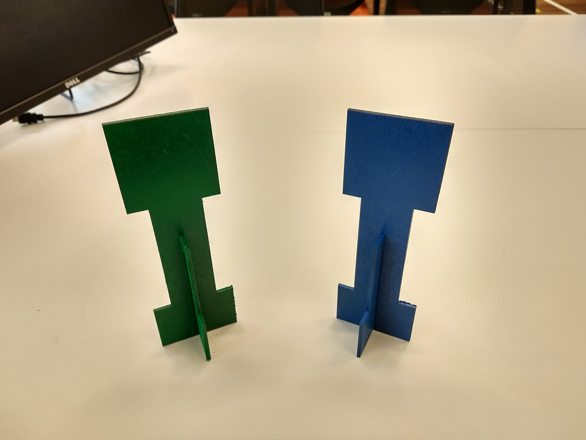

# Robótica Computacional - Atividade 1 do projeto

## Parte 1 

Atenção: o grupo de 3 pessoas desta atividade deve se manter fixo até a entrega do projeto. Você **pode trocar** o grupo com que fez atividades anteriores. 

Deadline: **19/3**

Referências:
Cap. 7 do ROS Robot Programming


### Objetivo: 

Desenvolver software conectado a um robô real, familiarizar-se com os comandos do *ROS* para terminal e para programação em Python.

### Atividade:

Siga [este guia](https://github.com/Insper/robot20/blob/master/guides/bringup_turtlebot.md) e conecte-se a um robô real que deve ser fornecido pelos técnicos.  No mundo do ROS o ato de se conectar a um robô é chamado de *bringup*

[Existe uma playlist com vídeos para facilitar esta conexão](https://www.youtube.com/playlist?list=PLM8rZg4fCalguCrL6BfKBelLed5HMEA5v)

Avise aos técnicos do Lab sobre qual robô seu grupo vai usar

Explore o tópico `/bumper`  , que é o sensor dos pára-choques do robô, usando [este outro guia](https://github.com/Insper/robot19/blob/master/guides/ros_topics.md)


### Programação:

Agora veja o guia de [ROS Python](../guides/projeto_rospython.md)

Desenvolva um programa em Python/ROS que faça manobras evasivas com o robô após a deteção de uma colisão no sensor *bumper*. Esta entrega já vai ser fazer parte da nota de Projeto 1, além de contar como atividade.

As manobras evasivas precisam afastar o robô do objeto com o qual ele colidiu.

Sugerimos que use o **Python 2** . Não se esqueça de começar todo arquivo `.py` com as duas linhas a seguir:
```python
#! /usr/bin/env python
# -*- coding:utf-8 -*-
```

### Código auxílio

**Dica** o código a seguir dá um começo, basta modificá-lo para fazer a manobra evasiva sempre que uma colisão for detectada. Lembre-se de que você precisa seguir o [guia sobre como criar um projeto ROSPython](https://github.com/Insper/robot20/blob/master/guides/projeto_rospython.md)  ou usar um projeto já existente.

```python
#! /usr/bin/env python
# -*- coding:utf-8 -*-

import rospy
import numpy as np
from geometry_msgs.msg import Twist, Vector3
from std_msgs.msg import UInt8

bumper = 0

def colidiu(dado):
	global bumper
	bumper = dado.data
	print(dado.data)


if __name__=="__main__":

	rospy.init_node("")

	velocidade_saida = rospy.Publisher("/cmd_vel", Twist, queue_size = 3 )
	recebe_scan = rospy.Subscriber("/bumper", UInt8, colidiu)

    v = 0.3
    w = 0.1

	while not rospy.is_shutdown():
        print("Leitura do bumper ", bumper)
		velocidade = Twist(Vector3(v, 0, 0), Vector3(0, 0,w))
		velocidade_saida.publish(velocidade)
		rospy.sleep(0.5)


```


### Informações úteis - PARAR

Para parar o robô, copie e cole o seguinte comando no terminal:

    rostopic pub -1 /cmd_vel geometry_msgs/Twist -- '[0.0, 0.0, 0.0]' '[0.0, 0.0, 0.0]'


# Parte 2

No ROS a OpenCV trabalha com base em eventos. Esta atividade permite que você estude isso mais a fundo


### 1. Programa ROS 

Primeiro rode o programa que centraliza numa caixa vermelha. Pegue uma caixa emprestada com a equipe do laboratório 404.

Faça um clone de [https://github.com/insper/robot20/](https://github.com/insper/robot20/) **dentro** de sua pasta `catkin_ws/src`.

    cd ~/catkin_ws/src
    git clone https://github.com/insper/robot20/

Lembre-se de **sempre** executar o `catkin_make` depois de criar novos arquivos `*.py`

    cd ~/catkin_ws
    catkin_make


Estude o código de `cor.py`. Você pode começar executando este programa. Primeiro **[conecte num robô](https://github.com/Insper/robot20/blob/master/guides/bringup_turtlebot.md)** para poder testar

Rode num terminal o comando para que o tópico de câmera tenha um repetidor (relay) chamado `/kamera`

    rosrun topic_tools relay /raspicam_node/image/compressed /kamera


E em outro terminal

    rosrun exemplos_python cor.py

Se necessário, **pegue uma caixa vermelha** emprestada com os técnicos do laboratório.


**Agora, faça:**



Modique este programa para que o robô centralize num creeper **azul** ou **verde**:

Depois de centralizar, usando a informação do *laser* (tópico `\scan`) faça o robô se aproximar do *creeper* e tocá-lo gentilmente.  Isso vai ser base para depois incluirmos o comando da garra do robô. 

Você deve testar com o robô a cerca de $1.75 m$ do creeper.


Crie [seu próprio projeto](https://github.com/Insper/robot20/blob/master/guides/projeto_rospython.md), não trabalhe na pasta clonada do professor.


## Testando sem o robô

Caso precise testar sem um robô físico, leia [este guia](https://github.com/Insper/robot20/blob/master/guides/debugar_sem_robo_opencv_melodic.md). Este conhecimento é muito útil em caso de provas. 


